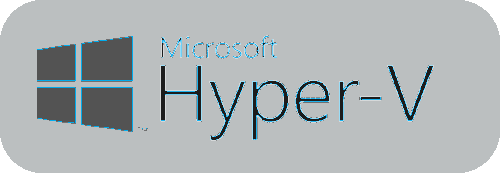

### Hi there 👋

I am a highly motivated individual with a strong background in programming, cultivated during my time at a specialized programming high school and now studying at the elite university of ELTE.

## Favored Operating Systems
    
## Skills

#### DevOps Tools
 

From my work experience I had the opportunity to experience multiple `DevOps` tools from microsoft and attlassian.

#### Programming Languages
        

My main programming language is C#, but I have a lot of experience in every other language listed above, feel free to reach out to me if you want to have a good discussion on programming topics.

#### Development Tools
, , , , , 

As my main OS is Arch linux, I use `vim`, and the `git cli` a lot.

#### Web Frameworks
       

Over the years I was able to master a few web frameworks.

#### Automation and Testing
   

#### Containerization
    

I like to dockerize my projects in my freetime and I have a lot of fun with the kubernetes and helm stack.

#### Server and Virtualization
   

I am running my own home server on Proxmox. Let me know if you have any question on that field.

## Social Networks

If you have any ideas about new project. You can reach me anywhere where I am available.

  
